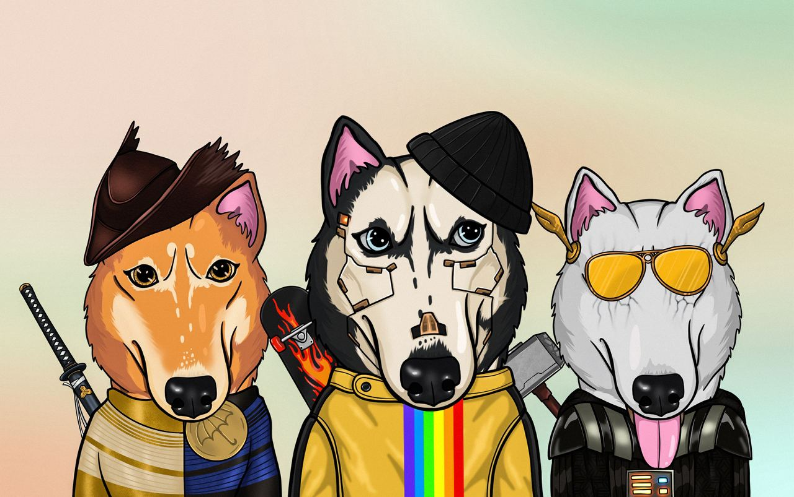

 

  

  <h3 align="center">NFT TON Dog Metaverse</h3>

  

    NFT Landing on TON Blockchain — Dog Metaverse.
     
     
    <a href="https://github.com/DeFiTON/NFT-Landing-TON-Dog-Metaverse"><strong>Explore the docs »</strong></a>
     
     
    <a href="https://github.com/DeFiTON/NFT-Landing-TON-Dog-Metaverse">View Demo</a>
    .
    <a href="https://github.com/DeFiTON/NFT-Landing-TON-Dog-Metaverse/issues">Report Bug</a>
    .
    <a href="https://github.com/DeFiTON/NFT-Landing-TON-Dog-Metaverse/issues">Request Feature</a>
  

      

## Table Of Contents

* [About the Project](#about-the-project)
* [Roadmap](#roadmap)
* [Contributing](#contributing)
* [License](#license)
* [Authors](#authors)
* [Acknowledgements](#acknowledgements)

## About The Project

Landing: NFT on TON Blockchain — Dog Metaverse.

* PHP
* JavaScript
* HTML
* CSS

## Roadmap

See the [open issues](https://github.com/DeFiTON/NFT-Landing-TON-Dog-Metaverse/issues) for a list of proposed features (and known issues).

## Contributing

Contributions are what make the open source community such an amazing place to be learn, inspire, and create. Any contributions you make are **greatly appreciated**.
* If you have suggestions for adding or removing projects, feel free to [open an issue](https://github.com/DeFiTON/NFT-Landing-TON-Dog-Metaverse/issues/new) to discuss it, or directly create a pull request after you edit the *README.md* file with necessary changes.
* Please make sure you check your spelling and grammar.
* Create individual PR for each suggestion.
* Please also read through the [Code Of Conduct](https://github.com/DeFiTON/NFT-Landing-TON-Dog-Metaverse/blob/main/CODE_OF_CONDUCT.md) before posting your first idea as well.

### Creating A Pull Request

1. Fork the Project
2. Create your Feature Branch (`git checkout -b feature/AmazingFeature`)
3. Commit your Changes (`git commit -m 'Add some AmazingFeature'`)
4. Push to the Branch (`git push origin feature/AmazingFeature`)
5. Open a Pull Request

## License

Distributed under the MIT License. See [LICENSE](https://github.com/DeFiTON/NFT-Landing-TON-Dog-Metaverse/blob/main/LICENSE.md) for more information.

## Authors

* **DeFiTON** - *Sviatoslav Gusev* - [DeFiTON](https://github.com/DeFiTON) - *CPO*

## Acknowledgements

* [DimaTsilenko](https://github.com/DimaTsilenko)
* [yrdevel](https://github.com/yrdevel)
* [Lana4cool](https://github.com/Lana4cool)

